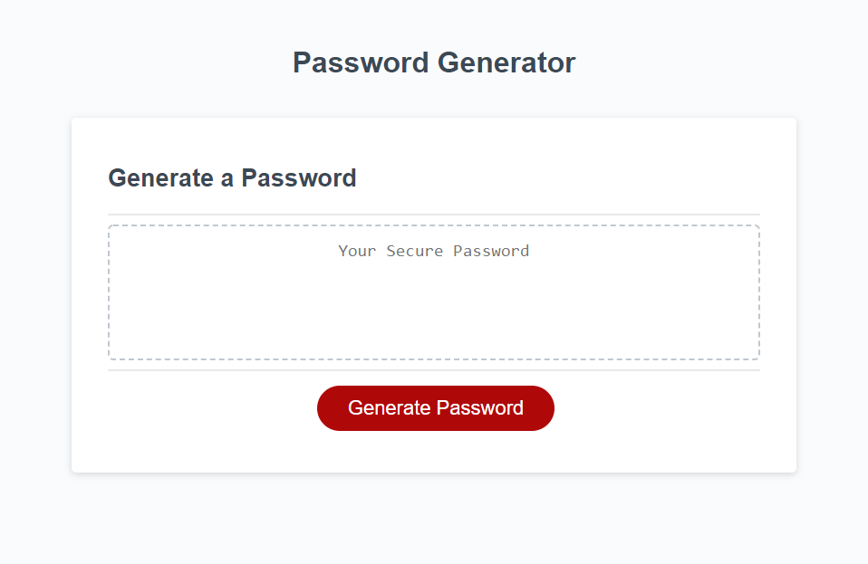

# Unique Password Generator

## Purpose

Provide the ability to create a unique and secure password built with characters determined by a series of confirmation prompts. 

## Steps taken

* Created variables for the characters/arrays to be used in the creation of the password

* Grouped the prompts with their respective if statements that determine the characters to be used within a larger function

* Defined the generatePassword function and created a for loop to randomize the order of the characters used.

* modified the writePassword function by adding a for loop so the password would only be created when the prompts were answered and the user chose a character length within the parameters provided in the prompt. 

## Webpage

* Link: https://stricker2.github.io/unique-password-generator/

### Contributors

JavaScript written by Andrew Secore. HTML and CSS were prewritten and not altered.